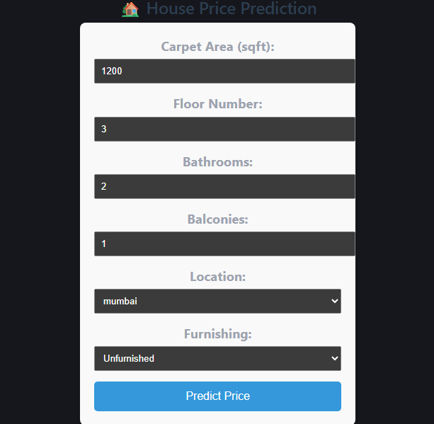

# 🏡 House Price Prediction - Full Stack ML Application

## 📖 Overview

The **House Price Prediction** project is a comprehensive Full Stack Machine Learning web application. It allows users to input various features of a house (like area, number of bedrooms, and location) and get an estimated market price instantly. The system integrates a React frontend with a FastAPI backend serving a Scikit-Learn model.

---

## 🏗️ Architecture Diagram

* **Frontend:** Collects user inputs and sends a JSON payload.
* **Backend:** Receives data, preprocesses it, and feeds it to the `.pkl` ML model.
* **Model:** Predicts the price and returns the output to the client.

---

## 🛠️ Tech Stack

* **Frontend:** React.js, Vite, HTML5, CSS3, JavaScript
* **Backend:** Python, FastAPI, Uvicorn, Pydantic
* **Machine Learning:** Scikit-Learn, Pandas, NumPy, Joblib
* **Tools:** Jupyter Notebook, Git, GitHub

---

## 📁 Project Structure

```text
house-price-prediction/
├── backend/                  # FastAPI Server & ML Model API
│   ├── main.py               # API Endpoints
│   ├── house_price.pkl       # Trained Model File
│   ├── locations.json        # Allowed locations for the frontend dropdown
│   ├── requirements.txt      # Python Dependencies
│   └── .env                  # Backend Environment variables
├── frontend/                 # React UI Application
│   ├── src/                  # React Components & Styles
│   ├── package.json          # Node Dependencies
│   └── .env                  # Frontend Environment variables
├── notebooks/                # ML Pipeline & Data Analysis
│   └── house_price_model.ipynb
├── assets/                   # Screenshots and diagrams
└── README.md                 # Project Documentation
```

---

## 💾 Dataset & Download Instructions

Due to GitHub file size limits, the raw dataset and trained model are not uploaded.

* **Dataset Link:** [Kaggle - House Price Dataset](https://www.kaggle.com/datasets/juhibhojani/house-price)

**Instructions:**
1. Download `house_prices.csv` from Kaggle.
2. Place it inside the `notebooks/` directory.
3. Run the Jupyter Notebook (`notebooks/house_price_model.ipynb`) to train the model and generate `house_price.pkl`.
4. Move `house_price.pkl` into the `backend/` directory.

---

## ⚙️ Environment Variables

### Backend (`backend/.env`)

| Variable Name | Description | Default Value |
|---|---|---|
| `PORT` | The port on which FastAPI runs | `8000` |
| `MODEL_PATH` | Path to the trained model | `./house_price.pkl` |

### Frontend (`frontend/.env`)

| Variable Name | Description | Default Value |
|---|---|---|
| `VITE_API_URL` | The base URL for the backend API | `http://127.0.0.1:8000` |

---

## 🚀 Setup Steps

### 1️⃣ Backend Setup (FastAPI)

1. Navigate to the backend directory:
   ```bash
   cd backend
   ```
2. Create and activate a virtual environment:
   - Windows: `.venv\Scripts\activate`
   - Mac/Linux: `source .venv/bin/activate`
3. Install dependencies:
   ```bash
   pip install -r requirements.txt
   ```
4. Run the server:
   ```bash
   python -m uvicorn main:app --reload
   ```

The backend will run on **http://127.0.0.1:8000** — test it live at **http://127.0.0.1:8000/docs**.

### 2️⃣ Frontend Setup (React + Vite)

1. Open a new terminal and navigate to the frontend directory:
   ```bash
   cd frontend
   ```
2. Install dependencies:
   ```bash
   npm install
   ```
3. Start the dev server:
   ```bash
   npm run dev
   ```

---

## 🔌 API Reference

### `POST /predict`

Predicts the house price based on input features.

**cURL Request Example:**

```bash
curl -X 'POST' \
  'http://127.0.0.1:8000/predict' \
  -H 'accept: application/json' \
  -H 'Content-Type: application/json' \
  -d '{
  "area": 1500,
  "bedrooms": 3,
  "bathrooms": 2,
  "location_index": 5,
  "age": 10
}'
```

**Successful Response:**

```json
{
  "predicted_price": 250000.50
}
```

---

## 📊 Model Metrics

The Machine Learning model was evaluated using standard regression metrics:

| Metric | Score | Description |
|---|---|---|
| R² Score | 0.9165 | Explains ~91.7% of the variance in house prices. |
| MAE | ₹1,068,133.09 | Mean Absolute Error. |
| RMSE | ₹4,100,288.27 | Root Mean Squared Error. |

---

## 📸 Screenshots

### Home Page / Input Form



### Prediction Result


